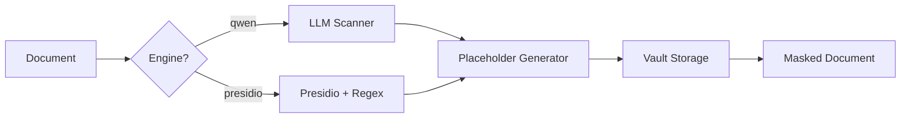

<div align="center">


# VibeMask

**Privacy-Preserving AI Tool Wrapper**

Automatically mask sensitive information before AI processing, then restore after.

[](https://www.python.org/downloads/)
[](https://opensource.org/licenses/MIT)
[]()

[Features](#-features) • [Quick Start](#-quick-start) • [Documentation](#-documentation) • [Architecture](#-architecture)

</div>

---

## 🎯 Problem

When using AI tools (Claude, ChatGPT, Copilot) with sensitive documents, private information like names, phone numbers, and IDs may be exposed. VibeMask solves this by:

1. **Detecting** PII using LLM (Qwen) or rule-based engines
2. **Masking** with length-preserving, format-preserving placeholders
3. **Storing** mappings securely in a local vault
4. **Restoring** original data after AI processing

## ✨ Features

| Feature | Description |
|---------|-------------|
| 🔒 **Auto Detection** | LLM-powered (Qwen) + Presidio + Regex detection |
| 📐 **Format Preserving** | Masked text keeps same length and structure |
| 🔓 **Lossless Restore** | Perfect roundtrip: mask → AI → restore = original |
| 💾 **Secure Vault** | SQLite storage outside project directory |
| 🌐 **Web UI** | Modern drag-and-drop interface |
| 📄 **Office Support** | DOCX, XLSX, PPTX, PDF with lossless processing |
| ⚡ **High Performance** | 100K chars in < 2 seconds |

## 🚀 Quick Start

### Installation

```bash
# Clone the repository
git clone https://github.com/your-username/vibemask.git
cd vibemask

# Install with standard dependencies
pip install -e ".[standard]"

# For full installation (including PDF support)
pip install -e ".[full]"
```

### LLM Setup (Recommended)

```bash
# Install Ollama (https://ollama.ai)
# Then pull the recommended model:
ollama pull qwen3:4b-instruct
```

### Basic Usage

```bash
# Mask a file (auto-detect PII with LLM)
vibemask mask document.docx --engine qwen

# Mask with rule-based engine (no LLM required)
vibemask mask document.docx --engine presidio

# Restore after AI processing
vibemask restore document_masked.docx

# View masking sessions
vibemask sessions

# Check system status
vibemask status

# Start Web UI
vibemask ui
```

### Python API

```python
from vibemask.detector.llm_scanner import LLMScanner
from vibemask.vault.storage import VaultStorage

# Check Ollama availability
scanner = LLMScanner()
if scanner.is_available():
    result = scanner.scan_and_rewrite(text)
    print(f"Detected {len(result.pii_types)} PII entities")
else:
    print("Ollama not available, use --engine presidio")

# Use vault for consistent mappings
vault = VaultStorage("/path/to/project")
masked = vault.get_or_create_mapping("张三", "PERSON", "赵甲")
original = vault.get_mapping_by_masked(masked)  # Returns "张三"
```

## 📊 Supported PII Types

| Type | Example | Masked | Length Preserved |
|------|---------|--------|------------------|
| 姓名 (PERSON) | 张三 | 赵甲 | ✅ |
| 电话 (PHONE) | 138-1234-5678 | 140-0000-0000 | ✅ |
| 邮箱 (EMAIL) | test@example.com | u001@example.com | ✅ |
| 身份证 (IDCN) | 110101198801011234 | 110101198001010002 | ✅ |
| 地址 (ADDRESS) | 北京市朝阳区xxx路123号 | 某某某某某某XXX某000某 | ✅ |
| 日期 (DATE) | 2024-01-15 | 0000-00-00 | ✅ |
| URL | https://example.com/user | https://example.com/U001 | ✅ |

## 🏗 Architecture

```
vibemask/
├── core/                   # Core processing
│   ├── factory.py          # File processor factory
│   ├── ooxml.py            # DOCX/XLSX/PPTX lossless processing
│   ├── converter.py        # Legacy Office format conversion
│   └── span.py             # Entity types and spans
├── detector/               # PII Detection
│   ├── llm_scanner.py      # LLM-based detection (Qwen via Ollama)
│   ├── presidio_engine.py  # Rule-based detection (Presidio)
│   └── smart_detector.py   # Chinese name detection (Jieba + spaCy)
├── masker/
│   └── placeholder.py      # Length-preserving placeholder generation
├── vault/
│   └── storage.py          # SQLite vault for mapping persistence
├── restore/
│   └── git.py              # Git diff restoration
├── web/
│   ├── api.py              # FastAPI backend
│   └── server.py           # Web server
└── cli.py                  # CLI interface (Typer)
```

### Detection Pipeline



### Unique Mapping Guarantee

- **Same original → Same mask**: `张三` always maps to the same placeholder
- **Different originals → Different masks**: Auto-conflict resolution
- **Lossless roundtrip**: mask → restore = original (verified with 23 tests)

## 📁 File Support

| Format | Detection | Masking | Lossless |
|--------|-----------|---------|----------|
| `.txt` / `.md` | ✅ | ✅ | ✅ |
| `.docx` | ✅ | ✅ | ✅ |
| `.xlsx` | ✅ | ✅ | ✅ |
| `.pptx` | ✅ | ✅ | ✅ |
| `.pdf` | ✅ | ✅ | ⚠️ Text layer only |
| `.doc` / `.xls` | ✅ | ✅ | ⚠️ Requires LibreOffice |

## 🔧 Configuration

Create `.vibemask.yaml` in your project root:

```yaml
# Entity types to detect
enabled_types: [PERSON, PHONE, EMAIL, IDCN, ADDRESS]

# LLM settings
llm:
  model: qwen3:4b-instruct
  base_url: http://localhost:11434

# Masking options
masking:
  length_preserve: true
  email:
    preserve_domain: true

# Paths to exclude
paths:
  exclude:
    - "**/node_modules/**"
    - "**/.git/**"
    - "**/dist/**"

# Whitelist (never mask these)
whitelist:
  - 产品名称
  - 公司名称
```

## 📊 Data Storage

Mappings are stored outside your project for security:

```
~/.vibemask/
├── projects/<fingerprint>/
│   └── vault.sqlite      # Mapping database
└── logs/
```

## 🧪 Testing

```bash
# Run all tests
pytest tests/ -v

# Run specific test categories
pytest tests/test_comprehensive_pii.py -v      # PII detection tests
pytest tests/test_lossless_roundtrip.py -v     # Roundtrip tests
pytest tests/test_sample_files_roundtrip.py -v # Real file tests
```

## 🛠 Development

```bash
# Install dev dependencies
pip install -e ".[dev]"

# Format code
black vibemask/
ruff check vibemask/

# Run tests
pytest tests/ -v
```

## 📋 Requirements

- Python 3.10+
- **Optional**: [Ollama](https://ollama.ai) for LLM-based detection
- **Optional**: [LibreOffice](https://www.libreoffice.org) for legacy `.doc`/`.xls` support

## 🤝 Contributing

Contributions are welcome! Please:

1. Fork the repository
2. Create a feature branch (`git checkout -b feature/amazing-feature`)
3. Commit your changes (`git commit -m 'Add amazing feature'`)
4. Push to the branch (`git push origin feature/amazing-feature`)
5. Open a Pull Request

## 📜 License

This project is licensed under the MIT License - see the [LICENSE](LICENSE) file for details.

## 🙏 Acknowledgments

- [Presidio](https://github.com/microsoft/presidio) - Microsoft's PII detection library
- [Ollama](https://ollama.ai) - Local LLM runtime
- [Qwen](https://github.com/QwenLM/Qwen) - Alibaba's language model

---

<div align="center">

**Made with ❤️ for privacy-conscious AI users**

</div>
