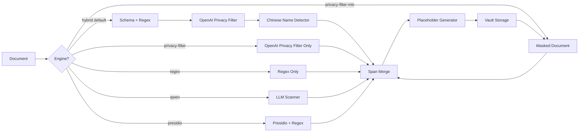

<div align="center">


# VibeMask

**Privacy-Preserving AI Tool Wrapper**

Automatically mask sensitive information before AI processing, then restore after.

[](https://www.python.org/downloads/)
[](https://opensource.org/licenses/MIT)
[]()

[Features](#-features) • [Quick Start](#-quick-start) • [Documentation](#-documentation) • [Architecture](#-architecture)

</div>

---

## 🎯 Problem

When using AI tools (Claude, ChatGPT, Copilot) with sensitive documents, private information like names, phone numbers, and IDs may be exposed. VibeMask solves this by:

1. **Detecting** PII using a hybrid pipeline: schema/regex rules, OpenAI Privacy Filter, and optional LLM engines
2. **Masking** with reversible typed placeholders and format-aware structured masks
3. **Storing** mappings securely in a local vault
4. **Restoring** original data after AI processing

## ✨ Features

| Feature | Description |
|---------|-------------|
| 🔒 **Auto Detection** | Hybrid detection with schema rules, regex, OpenAI Privacy Filter native spans, Qwen, and Presidio |
| 📐 **Format Aware** | Structured values keep useful shape where possible; names use clear typed tokens |
| 🔓 **Lossless Restore** | Perfect roundtrip: mask → AI → restore = original |
| 💾 **Encrypted Vault** | AES-256-GCM field encryption with per-project keys in the OS keyring |
| 🌐 **Web UI** | Modern drag-and-drop interface |
| 📄 **Office Support** | DOCX, XLSX, PPTX, PDF with lossless processing |
| ⚡ **High Performance** | 100K chars in < 2 seconds |

## 🚀 Quick Start

### Installation

```bash
# Clone the repository
git clone https://github.com/your-username/vibemask.git
cd vibemask

# Apple Silicon default: standard dependencies plus MLX Privacy Filter support
pip install -e ".[standard,privacy-filter-mlx]"

# Optional: official OPF backend for baseline comparisons
pip install -e ".[privacy-filter]"

# For full installation (including PDF support)
pip install -e ".[full]"
```

### Privacy Filter Setup (Recommended)

VibeMask uses a hybrid detector by default. On Apple Silicon, that hybrid pipeline uses
the MLX Privacy Filter backend unless you explicitly choose OPF. Deterministic schema
and regex layers remain enabled for structured Office files and Chinese tabular documents.
The CLI loads the model for the current command and exits after processing; it does not
run a background service.

The recommended default command is simply:

```bash
# Default: hybrid detector with MLX Privacy Filter backend + viterbi decode
vibemask mask document.docx
```

This default path has been validated on real Chinese Office documents (student lists,
faculty lists, legacy `.xls` admission lists) with ≥99.6% recall / 100% precision for
actual PII values, zero residual PII in masked output, and lossless roundtrip restore.

Platform exceptions:

```bash
# Linux / Windows / Intel Mac: MLX is unavailable, use the native OPF backend
vibemask mask document.docx --privacy-backend opf

# Fully offline / no model environment: fast deterministic rules only
vibemask mask document.docx --engine regex
```

Other baseline engines:

```bash
# Run only OpenAI Privacy Filter when you need a pure OPF baseline
vibemask mask document.docx --engine privacy-filter --privacy-device cpu

# Run only the MLX Privacy Filter backend
vibemask mask document.docx --engine privacy-filter-mlx
```

By default, the vault project is the input file's folder. Use `--project-root` when
several folders should intentionally share one reversible mapping vault.

### LLM Setup (Optional)

```bash
# Install Ollama (https://ollama.ai)
# Then pull the recommended model:
ollama pull qwen3:4b-instruct
```

### Basic Usage

```bash
# Mask a file with the default hybrid detector
vibemask mask document.docx

# Use a specific vault project folder
vibemask mask folder/document.docx --project-root folder

# Mask with only OpenAI Privacy Filter
vibemask mask document.docx --engine privacy-filter

# Mask with the Apple Silicon MLX Privacy Filter backend
vibemask mask document.docx --engine privacy-filter-mlx

# Mask with deterministic regex rules only
vibemask mask document.docx --engine regex

# Mask with the Qwen detector
vibemask mask document.docx --engine qwen

# Mask with rule-based engine
vibemask mask document.docx --engine presidio

# Restore after AI processing
vibemask restore document_masked.docx

# View masking sessions
vibemask sessions

# Check system status
vibemask status

# Start Web UI
vibemask ui
```

### Wrap Codex / Claude

For one-off use, prefix any terminal command with `vibemask --`:

```bash
vibemask -- codex "帮我处理张三的材料"
vibemask -- claude -p "总结 13812345678 这条记录"
vibemask -- python script.py "处理张三"
```

For direct terminal use, enable shell wrappers:

```bash
eval "$(vibemask shell-init)"

codex "帮我处理张三的材料"
claude -p "总结 13812345678 这条记录"
claude-yolo "修改这个项目"
```

The wrapper masks command-line prompt arguments locally, runs the real AI CLI once, then
restores masked tokens in changed git files from the local vault. It does not keep a
background model service running after the command exits. To make this permanent, add
the `eval` line to `~/.zshrc`.

If the AI tool will read sensitive files from the workspace, mask those files first with
`vibemask mask`; the shell wrapper does not silently rewrite an entire folder before
launching the tool.

### Python API

```python
from vibemask.detector.llm_scanner import LLMScanner
from vibemask.vault.storage import VaultStorage

# Check Ollama availability
scanner = LLMScanner()
if scanner.is_available():
    result = scanner.scan_and_rewrite(text)
    print(f"Detected {len(result.pii_types)} PII entities")
else:
    print("Ollama not available, use --engine presidio")

# Use vault for consistent mappings
vault = VaultStorage("/path/to/project")
masked = vault.get_or_create_mapping("张三", "PERSON", "{{PERSON_000001}}")
original = vault.get_mapping_by_masked(masked)  # Returns "张三"
```

## 📊 Supported PII Types

Every mask is a **type-preserving token** so a downstream LLM knows what field it
stands for (and processes it accordingly) instead of discarding it as noise:

```

```

`TYPE` names the field; `shape` is a **fully redacted** template of the original
(digit → `#`, ASCII letter → `X`, CJK → `某`; separators kept). No original
character survives, yet the shape tells the LLM "this is a phone / an 18-digit
ID / …". The whole token is the vault key, so masking is losslessly reversible.
Names/organizations carry no useful shape, so they use a bare typed token.

| Type | Example | Masked |
|------|---------|--------|
| 姓名 (PERSON) | 张三 | `{{PERSON_000001}}` |
| 电话 (PHONE) | 138-1234-5678 | `{{PHONE_000001:###-####-####}}` |
| 邮箱 (EMAIL) | test@example.com | `{{EMAIL_000001:XXXX@XXXXXXX.XXX}}` |
| 身份证 (IDCN) | 110101198801011234 | `{{IDCN_000001:##################}}` |
| 地址 (ADDRESS) | 北京市朝阳区xxx路123号 | `{{ADDRESS_000001:某某某某某某XXX某###某}}` |
| 日期 (DATE) | 2024-01-15 | `{{DATE_000001:####-##-##}}` |
| URL | https://example.com/user | `{{URL_000001:XXXXX://XXXXXXX.XXX/XXXX}}` |

**Identifier policy**: personal identifiers — 工号/学号/准考证号/客户编号/会员号/卡号/病历号 —
are masked (the label word stays in the text, e.g. `工号 {{ACCOUNT_001:X######}}`).
Transaction references — 订单号/合同号/发票号/流水号 — are not personal data and are dropped.

## 🏗 Architecture

```
vibemask/
├── core/                   # Core processing
│   ├── factory.py          # File processor factory
│   ├── ooxml.py            # DOCX/XLSX/PPTX lossless processing
│   ├── converter.py        # Legacy Office format conversion
│   └── span.py             # Entity types and spans
├── detector/               # PII Detection
│   ├── privacy_filter.py   # OpenAI Privacy Filter native detector
│   ├── privacy_filter_mlx.py # Apple Silicon MLX Privacy Filter backend
│   ├── hybrid.py           # Recommended layered detector
│   ├── schema_context.py   # Field-label/schema-aware detection
│   ├── llm_scanner.py      # LLM-based detection (Qwen via Ollama)
│   ├── presidio_engine.py  # Rule-based detection (Presidio)
│   └── smart_detector.py   # Chinese name detection (Jieba + spaCy)
├── masker/
│   └── placeholder.py      # Type-preserving {{TYPE:shape}} placeholders
├── vault/
│   └── storage.py          # SQLite vault for mapping persistence
├── restore/
│   └── git.py              # Git diff restoration
├── web/
│   ├── api.py              # FastAPI backend
│   └── server.py           # Web server
└── cli.py                  # CLI interface (Typer)
```

```
eval/                      # Detection accuracy harness (golden dataset + P/R/F1)
├── metrics.py             # Per-type Precision/Recall/F1 + FP/FN detail
├── golden.py              # Golden dataset (substring-annotated, offset-validated)
└── runner.py              # `python -m eval.runner --engine hybrid`
```

### Accuracy

Detection accuracy is measured against a golden dataset and tracked in
[`eval/reports/BASELINE.md`](eval/reports/BASELINE.md). Current hybrid (MLX
Privacy Filter + deterministic layers) on the golden set:

| | Precision | Recall | F1 |
|---|---:|---:|---:|
| hybrid | 84.7% | 96.2% | 90.1% |
| deterministic (no model) | 89.5% | 73.9% | 81.0% |

Run it yourself: `HF_HUB_OFFLINE=1 python -m eval.runner --engine hybrid`
(model cached locally; set `HF_HUB_OFFLINE=1` when the network is flaky).

### Detection Pipeline



### Unique Mapping Guarantee

- **Same original → Same mask**: `张三` always maps to the same placeholder
- **Different originals → Different masks**: Auto-conflict resolution
- **Lossless roundtrip**: mask → restore = original (verified with 50 tests)

## 📁 File Support

| Format | Detection | Masking | Lossless |
|--------|-----------|---------|----------|
| `.txt` / `.md` | ✅ | ✅ | ✅ |
| `.docx` | ✅ | ✅ | ✅ |
| `.xlsx` | ✅ | ✅ | ✅ |
| `.pptx` | ✅ | ✅ | ✅ |
| `.pdf` | ✅ | ✅ | ⚠️ Text layer only |
| `.doc` / `.xls` | ✅ | ✅ | ⚠️ Requires LibreOffice |

## 🔧 Configuration

Create `.vibemask.yaml` in your project root:

```yaml
# Entity types to detect
enabled_types: [PERSON, PHONE, EMAIL, IDCN, ADDRESS]

# Detection engine
detection:
  engine: hybrid  # hybrid, privacy-filter, privacy-filter-mlx, regex, qwen, or presidio
  privacy_filter:
    backend: mlx  # mlx or opf
    device: cpu
    checkpoint: null  # MLX model repo/local dir, or OPF_CHECKPOINT/~/.opf/privacy_filter for OPF
    decode_mode: viterbi

# Masking options
masking:
  length_preserve: true
  email:
    preserve_domain: true

# Paths to exclude
paths:
  exclude:
    - "**/node_modules/**"
    - "**/.git/**"
    - "**/dist/**"

# Whitelist (never mask these)
whitelist:
  - 产品名称
  - 公司名称
```

## 📊 Data Storage

Mappings are stored outside your project for security:

```
~/.vibemask/
├── projects/<fingerprint>/
│   └── vault.sqlite      # Mapping database
└── logs/
```

Reversible values, session mappings, and source/output file names are encrypted
with AES-256-GCM. Each project has an independent random key stored by the
operating-system keyring (macOS Keychain, Windows Credential Manager, or the
configured Linux secret-service backend). Generated placeholders and aggregate
statistics remain plaintext because they do not contain original PII.

Existing plaintext vaults are migrated transactionally the first time they are
opened by this version. Migration does not print values or create a plaintext
backup. If the keyring is unavailable, or an encrypted vault's key has been
deleted, VibeMask fails closed instead of creating or using a plaintext vault.
Losing the key permanently makes that project's encrypted mappings impossible
to restore, so Keychain/keyring backups must be included in the user's backup
policy.

## 🧪 Testing

```bash
# Run all tests
pytest tests/ -v

# Run specific test categories
pytest tests/test_comprehensive_pii.py -v      # PII detection tests
pytest tests/test_lossless_roundtrip.py -v     # Roundtrip tests
pytest tests/test_sample_files_roundtrip.py -v # Real file tests
```

## 🛠 Development

```bash
# Install dev dependencies
pip install -e ".[dev]"

# Format code
black vibemask/
ruff check vibemask/

# Run tests
pytest tests/ -v
```

## 📋 Requirements

- Python 3.10+
- **Optional**: [Ollama](https://ollama.ai) for LLM-based detection
- **Optional**: [LibreOffice](https://www.libreoffice.org) for legacy `.doc`/`.xls` support

## 🤝 Contributing

Contributions are welcome! Please:

1. Fork the repository
2. Create a feature branch (`git checkout -b feature/amazing-feature`)
3. Commit your changes (`git commit -m 'Add amazing feature'`)
4. Push to the branch (`git push origin feature/amazing-feature`)
5. Open a Pull Request

## 📜 License

This project is licensed under the MIT License - see the [LICENSE](LICENSE) file for details.

## 🙏 Acknowledgments

- [Presidio](https://github.com/microsoft/presidio) - Microsoft's PII detection library
- [Ollama](https://ollama.ai) - Local LLM runtime
- [Qwen](https://github.com/QwenLM/Qwen) - Alibaba's language model

---

<div align="center">

**Made with ❤️ for privacy-conscious AI users**

</div>
